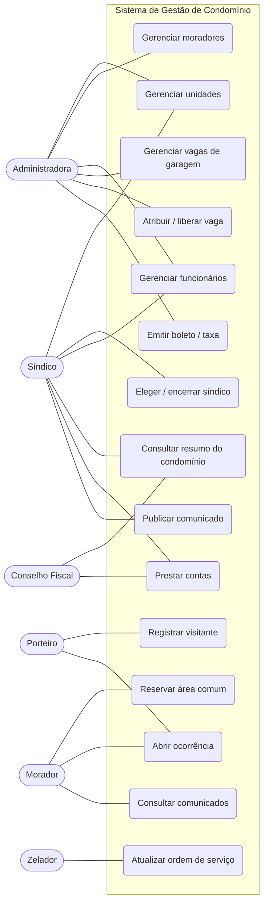

# 03 — Diagrama de Casos de Uso (proposta inicial)

```mermaid
flowchart LR
    Sindico([Síndico])
    Adm([Administradora])
    Morador([Morador])
    Porteiro([Porteiro])
    Zelador([Zelador])
    Conselho([Conselho Fiscal])

    subgraph Sistema[Sistema de Gestão de Condomínio]
        UC1(Gerenciar unidades)
        UC2(Gerenciar moradores)
        UC3(Eleger / encerrar síndico)
        UC4(Gerenciar funcionários)
        UC5(Gerenciar vagas de garagem)
        UC6(Atribuir / liberar vaga)
        UC7(Consultar resumo do condomínio)
        UC8(Registrar visitante)
        UC9(Reservar área comum)
        UC10(Emitir boleto / taxa)
        UC11(Prestar contas)
        UC12(Abrir ocorrência)
        UC13(Atualizar ordem de serviço)
        UC14(Publicar comunicado)
        UC15(Consultar comunicados)
    end

    Sindico --- UC1 & UC3 & UC4 & UC7 & UC11 & UC14
    Adm --- UC1 & UC2 & UC4 & UC5 & UC6 & UC10
    Morador --- UC9 & UC12 & UC15
    Porteiro --- UC8 & UC12
    Zelador --- UC13
    Conselho --- UC7 & UC11
```
